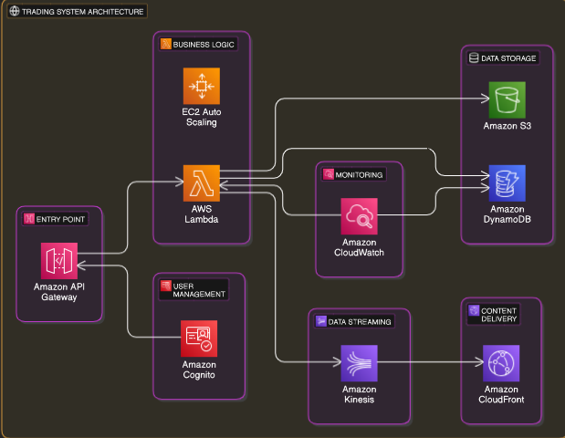

# Overview Diagram
Trading System Architecture

## Services and Their Roles
### Amazon API Gateway

Role: Acts as the entry point for all API requests, providing a scalable and secure way to handle incoming traffic.
Alternatives: NGINX, Kong.

### AWS Lambda:

Role: Handles business logic for order processing, user authentication, and other microservices. It scales automatically with the number of requests.
Alternatives: EC2 instances with Auto Scaling, AWS Fargate.

### Amazon DynamoDB:

Role: Stores user data, order books, and transaction logs. It offers low-latency and high-throughput performance.
Alternatives: Amazon RDS, Amazon Aurora.

### Amazon S3:

Role: Stores static assets, logs, and backups. It provides durable and scalable storage.
Alternatives: Google Cloud Storage, Azure Blob Storage.

### Amazon Kinesis:

Role: Streams real-time market data and order updates to users. It ensures low-latency data delivery.
Alternatives: Apache Kafka, AWS SNS/SQS.

### Amazon CloudFront:

Role: Distributes static and dynamic content globally with low latency and high transfer speeds.
Alternatives: Cloudflare, Akamai.

### Amazon Cognito:

Role: Manages user authentication and authorization, providing secure access to the system.
Alternatives: Auth0, Okta.

### Amazon CloudWatch:

Role: Monitors and logs system performance, providing insights for troubleshooting and optimization.
Alternatives: Datadog, New Relic.

## Scaling Plans
### API Gateway and Lambda:

Current Setup: Auto-scaling based on request volume.
Scaling Plan: Increase concurrency limits and provisioned concurrency for Lambda functions as traffic grows.

### DynamoDB:

Current Setup: On-demand capacity mode.
Scaling Plan: Use DynamoDB auto-scaling to adjust read/write capacity based on traffic patterns.

### Kinesis:

Current Setup: Initial shard count based on expected throughput.
Scaling Plan: Dynamically adjust the number of shards using Kinesis scaling policies.

### CloudFront:

Current Setup: Default distribution settings.
Scaling Plan: Enable additional edge locations and optimize caching policies as global traffic increases.

### This architecture leverages AWS services to ensure high availability, scalability, and cost-effectiveness. By using managed services like Lambda, DynamoDB, and Kinesis, we can focus on building the trading system's core features while AWS handles the infrastructure management. As the product grows, we can scale each component independently to meet increasing demand.
